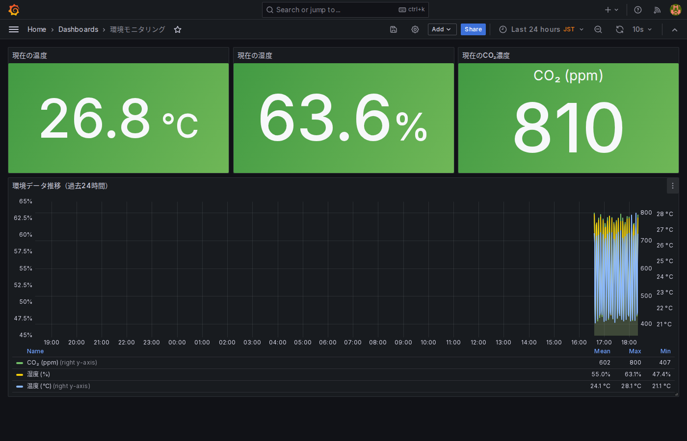
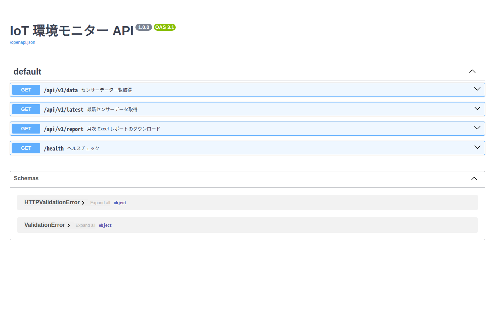
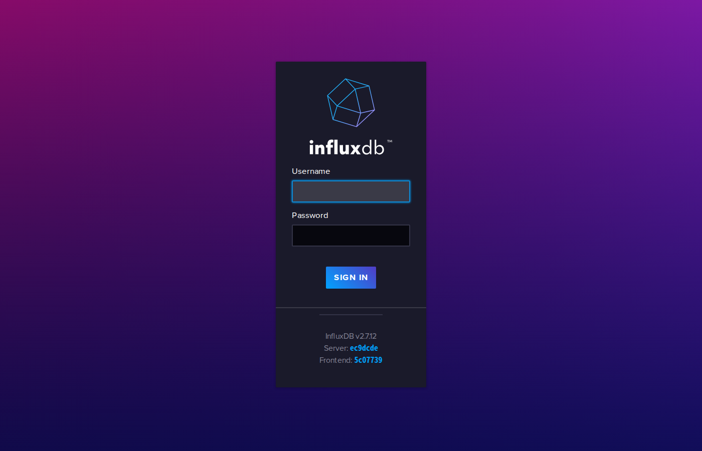
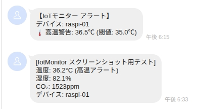
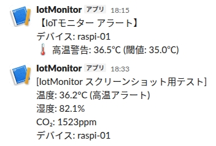

# IotMonitor


工場・倉庫・クリーンルーム・オフィスにおける **温度・湿度・CO₂・PM2.5** のリアルタイム収集・可視化・アラート通知システム。

センサから取得したデータを MQTT 経由で InfluxDB に蓄積し、Grafana でリアルタイム可視化するとともに、閾値超過時に **LINE / Slack** へ即時通知する。
複数デバイスの同時監視に対応しており、拠点や部屋ごとにセンサを設置して一元管理できる。

---

## 目次

1. [システムアーキテクチャ](#システムアーキテクチャ)
2. [スクリーンショット](#スクリーンショット)
3. [ハードウェア構成](#ハードウェア構成)
4. [ディレクトリ構成](#ディレクトリ構成)
5. [セットアップ](#セットアップ)
6. [サービスの起動](#サービスの起動)
7. [REST API](#rest-api)
8. [アラート設定](#アラート設定)
9. [月次レポート](#月次レポート)
10. [テスト](#テスト)
11. [技術スタック](#技術スタック)

---

## システムアーキテクチャ

```
センサ (Raspberry Pi)
    │ MQTT publish
    ▼
Mosquitto MQTT Broker (Docker: 1883)
    │ subscribe
    ├──────────────────────────────────────────┐
    ▼                                          ▼
データ収集サービス (collector)            アラートサービス (alerter)
    │ write                                    │ notify
    ▼                                          ▼
InfluxDB 2.7 (Docker: 8086)           LINE / Slack
    │ query
    ├──────────────────────┐
    ▼                      ▼
Grafana 10.4 (Docker: 3000)   FastAPI (8000)
リアルタイム可視化              REST API / Swagger UI

レポートサービス (reporter)
    └── InfluxDB → Excel 月次レポート
```

---

## スクリーンショット

### Grafana ダッシュボード（リアルタイム可視化）

温度・湿度・CO₂ のリアルタイムグラフ。データはシミュレーターまたは実機センサから 10 秒ごとに更新される。



---

### FastAPI — REST API ドキュメント（Swagger UI）

`http://localhost:8000/docs` にアクセスすると Swagger UI が表示される。
最新データの取得・月次レポートの生成・ヘルスチェックがブラウザ上から実行可能。



---

### InfluxDB — データエクスプローラー

蓄積されたセンサデータを Flux クエリで直接探索・可視化できる。



---

### LINE アラート通知

閾値を超えると LINE にプッシュ通知が届く（LINE Messaging API 使用）。



---

### Slack アラート通知

同一メッセージが Slack チャンネルにも投稿される。



---

## ハードウェア構成

### 最小構成（センサあり）

| パーツ | 型番 | 接続 | 役割 |
|---|---|---|---|
| Raspberry Pi 4B / 3B+ | — | — | メインボード |
| 温湿度・気圧センサ | BME280 | I2C | 温度・湿度・気圧測定 |
| CO₂ センサ | MH-Z19B | UART (`/dev/ttyS0`) | CO₂ 濃度測定 |
| PM2.5 センサ（オプション） | SDS011 | USB シリアル (`/dev/ttyUSB0`) | PM2.5 濃度測定 |

材料費目安: **約 ¥11,000〜**（SDS011 追加時 +¥3,000〜）

### センサなし（デモモード）

`simulator.py` が MQTT に模擬データ（温度・湿度・CO₂・PM2.5）を送信するため、PC 単体で全機能を動作確認できる。

**複数デバイスのシミュレーション:**

`.env` に `DEVICE_IDS` を設定すると、複数デバイスを並行してシミュレートできる。

```env
# カンマ区切りで複数デバイスを指定
DEVICE_IDS=raspi-01,raspi-02,raspi-03
```

各デバイスは独立したスレッドで動作し、温度ベースを 2℃ずつずらして環境差を表現する。

---

## ディレクトリ構成

```
IotMonitor/
├── common/          # メッセージ定数（全パッケージ共通）
├── sensor/          # センサ読み取り・シミュレーター
├── collector/       # MQTT → InfluxDB 収集サービス
├── alerter/         # 閾値チェック → LINE / Slack 通知
├── reporter/        # InfluxDB → Excel 月次レポート
├── api/             # FastAPI REST エンドポイント
├── mosquitto/       # Mosquitto 設定
├── grafana/         # Grafana プロビジョニング・ダッシュボード定義
├── scripts/         # 一括起動スクリプト
├── tests/           # pytest テストスイート
├── docs/screenshots/ # スクリーンショット
├── docker-compose.yml
├── pyproject.toml
└── .env.example
```

---

## セットアップ

### 前提条件

- Python 3.11 以上
- Docker / Docker Compose

### 1. リポジトリのクローン

```bash
git clone <repo-url>
cd IotMonitor
```

### 2. 仮想環境の作成とパッケージのインストール

```bash
python -m venv .venv
source .venv/bin/activate        # Windows: .venv\Scripts\activate
pip install -e ".[dev]"
```

### 3. 環境変数ファイルの設定

```bash
cp .env.example .env
```

`.env` を開いて以下を設定する:

```env
# InfluxDB（Docker 起動後に自動設定されるデフォルト値）
INFLUXDB_TOKEN=my-super-secret-token

# LINE Messaging API（LINE Developers で取得）
LINE_CHANNEL_ACCESS_TOKEN=your-channel-access-token
LINE_USER_ID=Uxxxxxxxxxxxxxxxxxxxxxxxxx

# Slack Incoming Webhook（Slack App で取得）
SLACK_WEBHOOK_URL=https://hooks.slack.com/services/xxx/yyy/zzz

# 通知先: line | slack | both
NOTIFY_CHANNEL=both
```

> **注意:** `.env` は Git にコミットしないこと（`.gitignore` で除外済み）

### LINE Messaging API の取得手順

1. [LINE Developers](https://developers.line.biz/) でプロバイダーを作成
2. Messaging API チャンネルを作成
3. 「Messaging API 設定」タブ → チャンネルアクセストークン（長期）を発行 → `LINE_CHANNEL_ACCESS_TOKEN`
4. 「基本設定」タブ → Your user ID（`U` から始まる文字列）→ `LINE_USER_ID`

### Slack Webhook の取得手順

1. [Slack API](https://api.slack.com/apps) でアプリを作成
2. 「Incoming Webhooks」を有効化
3. チャンネルを選択して Webhook URL を取得 → `SLACK_WEBHOOK_URL`

### 4. Docker インフラの起動

```bash
docker-compose up -d
```

| サービス | URL |
|---|---|
| Mosquitto MQTT | `localhost:1883` |
| InfluxDB | http://localhost:8086 |
| Grafana | http://localhost:3000 (admin / admin) |

---

## サービスの起動

### 一括起動（デモ推奨）

```bash
bash scripts/start_demo.sh
```

以下の順序で全サービスが起動する:

1. Docker インフラ（Mosquitto / InfluxDB / Grafana）
2. データ収集サービス（`collector.main`）
3. アラートサービス（`alerter.main`）
4. API サーバー（uvicorn / port 8000）
5. シミュレーター（`sensor.simulator`）

`Ctrl+C` で全プロセスが一括停止する。

### 個別起動

```bash
# データ収集サービス
python -m collector.main

# アラートサービス
python -m alerter.main

# API サーバー
uvicorn api.main:app --reload

# シミュレーター（別ターミナル）
python -m sensor.simulator
```

---

## REST API

API サーバー起動後、`http://localhost:8000/docs` で Swagger UI を参照できる。

| エンドポイント | メソッド | 説明 |
|---|---|---|
| `/api/v1/data` | GET | 指定期間のセンサデータを取得 |
| `/api/v1/latest` | GET | 最新センサデータを取得 |
| `/api/v1/report` | POST | 指定月の Excel レポートを生成 |
| `/health` | GET | サービスのヘルスチェック |

---

## アラート設定

`.env` で閾値を変更できる（デフォルト値）:

| 変数 | デフォルト | 説明 |
|---|---|---|
| `ALERT_TEMP_HIGH` | 35.0 | 高温アラート閾値（℃） |
| `ALERT_TEMP_LOW` | 5.0 | 低温アラート閾値（℃） |
| `ALERT_HUMIDITY_HIGH` | 80.0 | 高湿度アラート閾値（%） |
| `ALERT_HUMIDITY_LOW` | 20.0 | 低湿度アラート閾値（%） |
| `ALERT_CO2_HIGH` | 1500 | 高 CO₂ アラート閾値（ppm） |
| `ALERT_PM25_HIGH` | 35.0 | PM2.5 アラート閾値（μg/m³）※日本環境省基準 |
| `ALERT_COOLDOWN_MINUTES` | 15 | 同一デバイスのアラート間隔（分） |

---

## 月次レポート

REST API 経由または直接スクリプトで Excel レポートを生成できる:

```bash
# API 経由（JSON ボディで year / month / device_id を指定）
curl -X POST http://localhost:8000/api/v1/report \
  -H "Content-Type: application/json" \
  -d '{"year": 2026, "month": 6, "device_id": "raspi-01"}'
```

レポートには以下のシートが含まれる:
- **データシート**: 全計測値（温度・湿度・CO₂・気圧・PM2.5）の一覧
- **サマリーシート**: 日別の最大・最小・平均値と折れ線グラフ

---

## テスト

```bash
pytest
```

| テストファイル | 対象 | テスト数 |
|---|---|---|
| `tests/test_notifiers.py` | LINE / Slack 通知 | 11 |
| `tests/test_thresholds.py` | 閾値チェック（PM2.5 含む） | 21 |
| `tests/test_api.py` | FastAPI エンドポイント | 14 |
| `tests/test_simulator.py` | シミュレーター（複数デバイス・PM2.5 含む） | 14 |
| `tests/test_alerter_main.py` | アラータークールダウン | 11 |
| `tests/test_reporter.py` | Excel レポート生成 | 16 |
| **合計** | | **87** |

---

## 技術スタック

| 項目 | 採用技術 | バージョン |
|---|---|---|
| MQTT ブローカー | Eclipse Mosquitto | 2.x |
| 時系列 DB | InfluxDB | 2.7 |
| 可視化 | Grafana | 10.4 |
| API フレームワーク | FastAPI + uvicorn | 0.110+ |
| MQTT クライアント | paho-mqtt | 2.0+ |
| HTTP クライアント | httpx | 0.27+ |
| Excel 出力 | openpyxl | 3.1+ |
| LINE 通知 | LINE Messaging API (Push Message) | — |
| Slack 通知 | Incoming Webhook | — |
| テスト | pytest + pytest-asyncio | 8.0+ |
| コンテナ | Docker / Docker Compose | — |

---

## ライセンス

[MIT License](LICENSE) © 2026 TarkMatter
